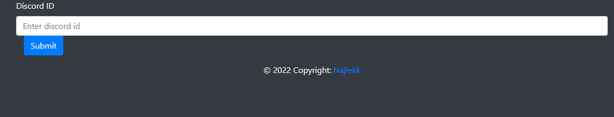
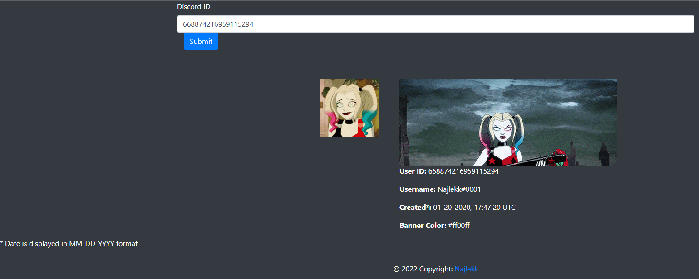
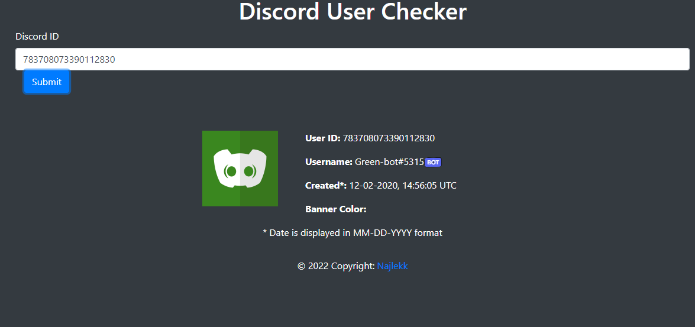

# discord-user-checker (FINAL UPDATE)

discord-user-checker is web app to check user's information. The project will no longer continue.

## Installation

Clone repository.

Download Git

[Node.js](https://nodejs.org/en/download/)

Then type in folder with this app
```bash
npm i
```

And change "settings.json.example" to "settings.json" and insert bot token after word "BOT"

Default port - 3000 (you can change it in settings file)

## Usage

```
node ./bin/www
```
After starting the app, follow the instructions displayed in the terminal

## Libraries

- axios
- express (and dependencies)
- moment

## Screenshots





## Information

All bugs can be reported in the "Issues" tab.

## License
[GNU General Public License v3.0](https://choosealicense.com/licenses/gpl-3.0/)

## Special thanks

